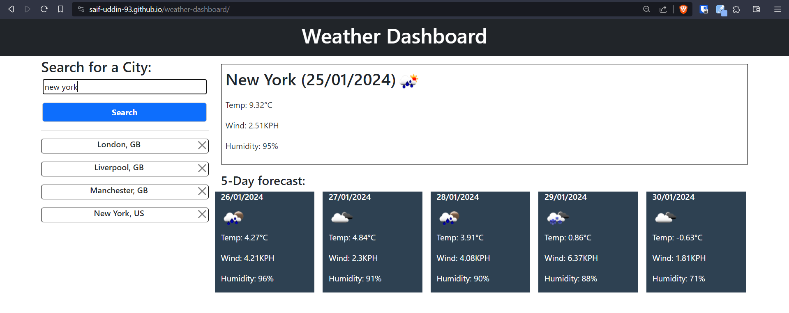

# Weather Dashboard

## Description

This project was created to create a weather forecast application. The aim was to be able to search for the weather forecast for the current day and the following 5 days. The project meets the following criteria:

* The weather forecast for the current day and the next 5 days are displayed when entering a city.
* Any saved searches are loaded if they exist.
* The country can be specified in the search by including the country code after the city, separated by a comma.
* The searches will be added below the search bar with the country code to specify to the user which country the city is in.
* The search item can be removed by clicking on the <b>X</b> at the end of the search item.
* All saved data is stored locally.

The main things I've learned from this project are:

* Gained an understanding of JS objects such as Date and how to convert Unix timestamps to readable dates.
* Practice writing more readable code using functional programming concepts.

[Link to deployed web page.](https://saif-uddin-93.github.io/weather-dashboard/)

## Table of Contents

- [User Story](#user-story)
- [Installation](#installation)
- [Usage](#usage)
- [Credits](#credits)
- [License](#license)

## User Story

```md
AS A frequent traveller
I WANT to check the weather at the destinations I plan to travel to
SO THAT I can effectively plan and bring appropriate items/clothing suitable for the weather.
```

## Installation

For this project, the developer tool I'll be using is VS Code. A lightweight IDE that allows working in JavaScript. It also allows the use of Extensions which can add extra functionality to the tool to help with debugging and making code more readable. The main extension I'll be using is called, Live Server, by Ritwick Dey. The browser that the web page will be used on is Google Chrome and will work on all Chromium-based web browsers. This project also includes the Bootstrap framework and the OpenWeatherAPI.

## Usage

The weather app can be utilised by entering a city name or a city name and a country code by separating them with a comma. For entering the correct state/country codes, please refer to the [ISO 3166](https://www.iso.org/obp/ui/#search) standardisation.

The forecasts in the 5-day forecast section are for 12 PM on their respective days.

Screenshot of the final application:


Searches are saved on the browsers local storage so the user can load the results again to get search results from the time when they made that search and can be deleted by clearing the cache or clicking on the <b>X</b> which will also remove the saved result from the local storage.

## Credits

Assets in this project belong to the edX organisers. All JavaScript in this project was written by myself.

## License
### MIT License

Copyright (c) 2023 Saif-Uddin-93

Permission is hereby granted, free of charge, to any person obtaining a copy of this software and associated documentation files (the "Software"), to deal in the Software without restriction, including without limitation the rights to use, copy, modify, merge, publish, distribute, sublicense, and/or sell copies of the Software, and to permit persons to whom the Software is furnished to do so, subject to the following conditions:

The above copyright notice and this permission notice shall be included in all copies or substantial portions of the Software.

THE SOFTWARE IS PROVIDED "AS IS", WITHOUT WARRANTY OF ANY KIND, EXPRESS OR IMPLIED, INCLUDING BUT NOT LIMITED TO THE WARRANTIES OF MERCHANTABILITY, FITNESS FOR A PARTICULAR PURPOSE AND NONINFRINGEMENT. IN NO EVENT SHALL THE AUTHORS OR COPYRIGHT HOLDERS BE LIABLE FOR ANY CLAIM, DAMAGES OR OTHER LIABILITY, WHETHER IN AN ACTION OF CONTRACT, TORT OR OTHERWISE, ARISING FROM, OUT OF OR IN CONNECTION WITH THE SOFTWARE OR THE USE OR OTHER DEALINGS IN THE SOFTWARE.

## Badges


